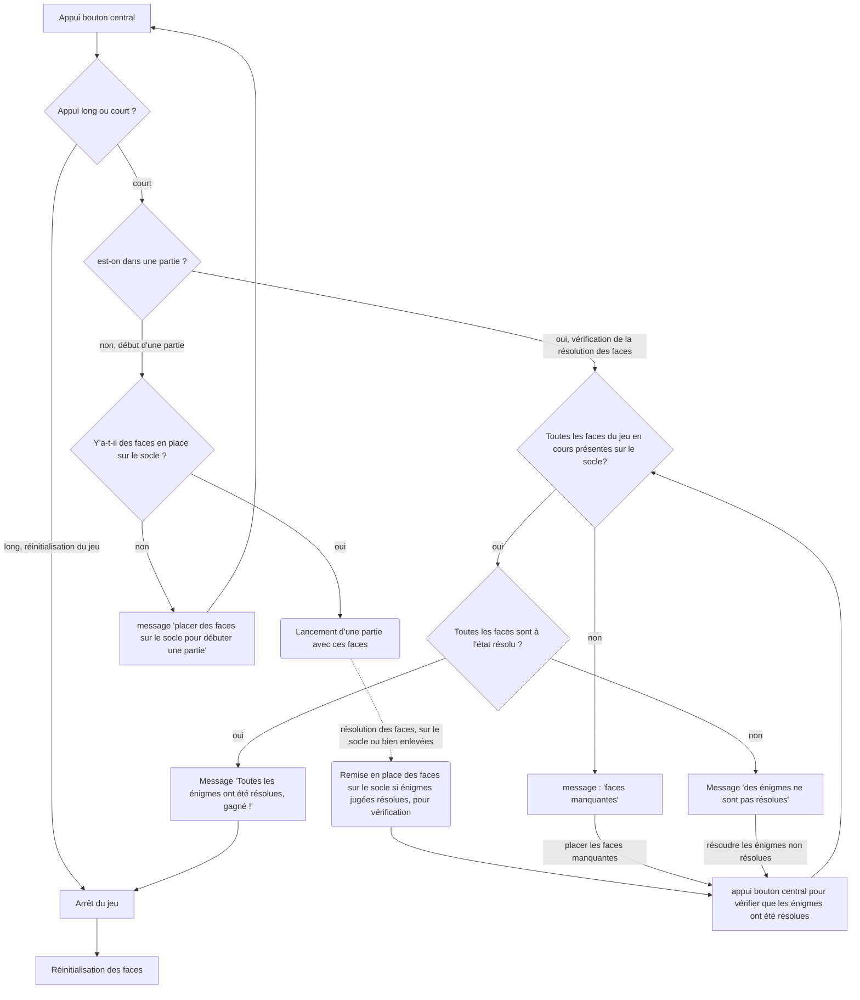

## Déroulement d'une partie
On part du principe qu'on a un socle où peuvent se placer les faces à n'importe quel endroit grâce à une connectique standardisée. Le socle dispose d'une partie centrale avec un bouton permettant d'initialiser une partie.

Chaque face correspond à un code couleur. Il est possible de choisir les faces avec lesquelles utilisées lors de la partie en appuyant sur les boutons de validation des faces. Si le bouton de validation d'une face est pressé et qu'ensuite le joueur initie une partie, la face sera comprise dans cette partie. 
Il est important de placer ces faces sur le socle avant une partie puis de réaliser un appui long sur le bouton de démarrage pour lancer une partie. Dès lors on peut résoudre les énigmes liées à ces faces, soit en les laissant sur le socle, ou alors en les détachant. Une fois qu'on juge chaque face résolue, on peut replacer les faces sur le socle et appuyer brièvement sur le bouton "Terminer" pour que le système vérifie si toutes nos faces sont bien résolues. Le cas échéant un message indique aux joueurs qu'ils ont gagné et les faces sont ensuite réinitialisées automatiquement (retour à l'état non résolu et réinitilisation de certains éléments dans le code/ou physiques de la face). Par contre s'il manque des faces sur le socle parmi celles utilisées pour lancer la partie, un message va demander de bien vouloir placer toutes les faces de la partie en cours sur le socle et de réappuyer sur le bouton pour vérification. D'autre part, si toutes les faces sont présentes mais qu'une ou plusieurs ne sont pas résolues, le système va indiquer, dans un message, de résoudre les faces non résolues.

À tout moment on peut faire un appui long sur le bouton pour arrêter le jeu et réinitialiser les faces

​		

