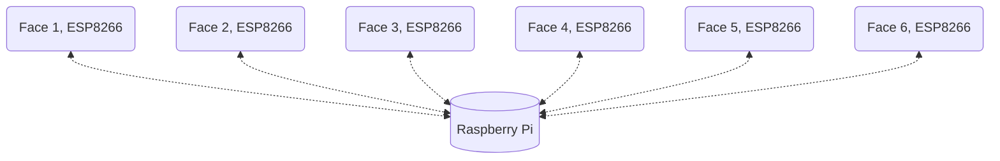

# Communication entre les faces et le socle

Ce document explique comment communiquent les faces et socle. Il contient un tableau qui référence les messages 

## Technologies utilisées :

### Wi-Fi :

Nos faces sont pensées pour être détachables. Afin que ces dernières puissent communiquer avec le socle même si elles sont détachées, nous avons besoin d'utiliser un protocole de communication sans-fil. Le Wi-Fi convient bien pour cet usage, il offre une connexion stable, avec suffisamment de portée pour nos besoins. Il est largement répandu, notamment sur des cartes très abordables : **ESP32**, **ESP8266**. Ces cartes sont des sortes d'Arduino améliorés, car elles embarquent de base la technologie Wi-Fi.

Pour les besoins de notre projet nous aurons une **architecture en étoile** : un **Raspberry Pi** au centre, dans le socle, et des **ESP8266**, un par face. Le Raspberry diffusera un réseau Wi-Fi auquel viendront se connecter les ESP8266. Si les besoins de la face requièrent des fonctionnalités qui dépassent les capacités d'un ESP8266, on pourra utiliser d'autre cartes : **ESP32** (un peu plus puissante, prise en charge du Bluetooth), **Raspberry Pi zero**, ...

### MQTT 

Le Wi-Fi ne se suffit pas à lui seul ; en effet il faut un protocole de communication pour échanger des messages entre les différentes parties de notre architecture. Nous allons utiliser le protocole **MQTT** (documentation : http://www.steves-internet-guide.com/mqtt-works/). 

MQTT utilise un système de **topics**. Chaque appareil peut **s'abonner** à un ou plusieurs topics. Dès lors il peut envoyer des messages sur ce topic ; et tous les autres appareils abonnés à ce topic recevront ce message. Ce fonctionnement marche dans tous les sens : les communications sont **bi-directionnelles.** Cela permet de classer les messages par type et d'en envoyer certains uniquement à des groupes d'appareils qui sont abonnés à certains topics.

Dans la documentation on peut voir que MQTT requiert l'usage d'un **Broker** central, qui filtre les messages suivant les topics et les redistribue ensuite aux abonnés. Ici le broker sera installé sur le Raspberry Pi du socle.

## Messages MQTT

Voici les différents topics et messages associés qui seront utilisés. 

### Messages communs

<table>
    <thead>
        <tr>
            <th>TOPIC</th>
            <th>MESSAGE</th>
            <th>PAYLOAD</th>
            <th>DIRECTION</th>
            <th>DESCRIPTION</th>
        </tr>
    </thead>
    <tbody>
        <!--L1-->
        <tr>
            <td rowspan=2>connection</td>
            <td>ask_connection_state</td>
            <td>"1" (pas utile mais payload ne peut être null)</td>
            <td>RPi --> *Faces</td>
            <td>Le RPi souhaite connaître les faces connectées sur le socle. À la suite de cet envoi, les faces doivent envoyer un message "connection_state"</td>
        </tr>
        <!--L2-->
        <tr>
            <td>connection_state</td>
            <td>{<b>face_id :</b> "facenumber"; <b>connected :</b> True|False}</td>
            <td>*faces-->RPi</td>
            <td>Les faces en marche envoient leur état : True si elles sont sur le socle, False sinon</td>
        </tr>
        <!--L3-->
        <tr>
            <td rowspan=4>game</td>
            <td>start</td>
            <td>"1" (pas utile mais payload ne peut être null)</td>
            <td>RPi --> *Faces en jeu</td>
            <td>Le RPi indique aux faces en jeu de démarrer leurs énigmes</td>
        </tr>
        <!--L4-->
        <tr>
            <td>ask_resolution_state</td>
            <td>"1" (pas utile mais payload ne peut être null)</td>
            <td>RPi --> *Faces en jeu</td>
            <td>Le RPi souhaite savoir si les faces en jeu sont résolues ou non</td>
        </tr>
        <!--L5-->
        <tr>	
            <td>resolution_state</td>
            <td>{<b>face_id :</b> "facenumber"; <b>resolved :</b> True|False}</td>
            <td>*Faces en jeu --> RPi</td>
            <td>Chaque face envoie son état de résolution (True si résolue, False sinon) au RPi</td>
        </tr>
        <!--L6-->
        <tr>	
            <td>reset</td>
            <td>"1" (pas utile mais payload ne peut être null)</td>
            <td>RPi --> *Faces en jeu</td>
            <td>Le RPi demande aux faces de se remettre à zéro (retour à l'état non résolu, par exemple après une partie)</td>
        </tr>
    </tbody>
</table>

### Logigramme déroulement jeu - messages MQTT

TODO

### 

### Messages spécifiques 

TODO, 

énigme wifi : (scan wifi ?), quizz, reconnaissances notes valide ou pas,..